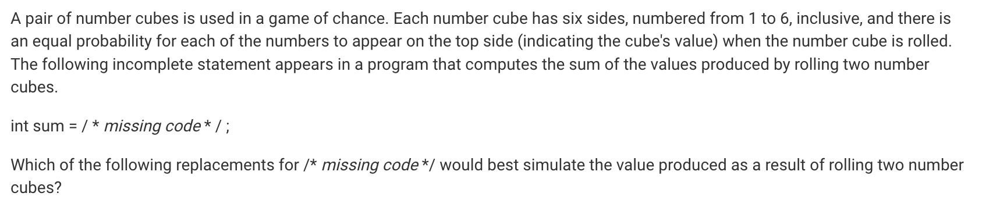
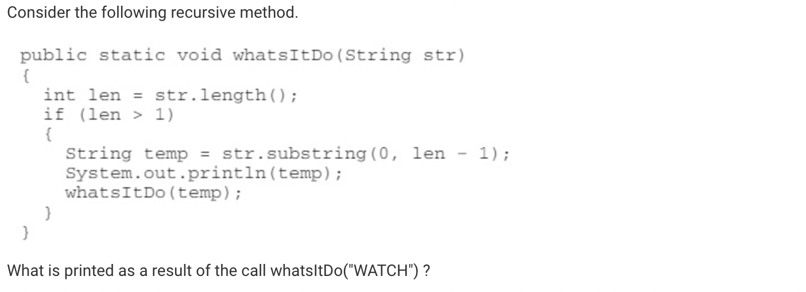
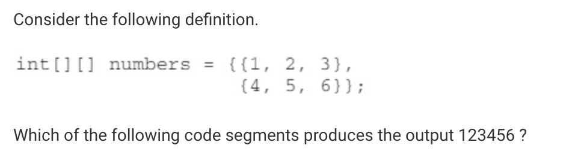
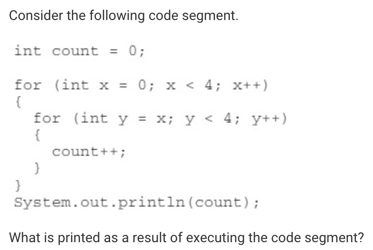
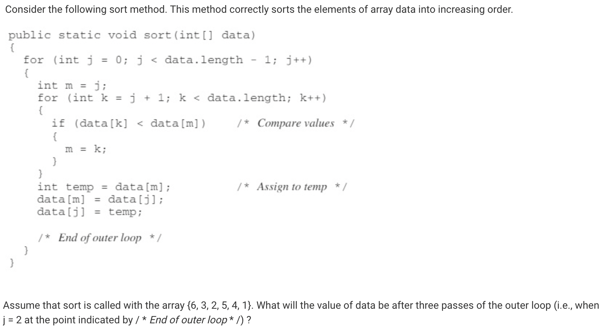
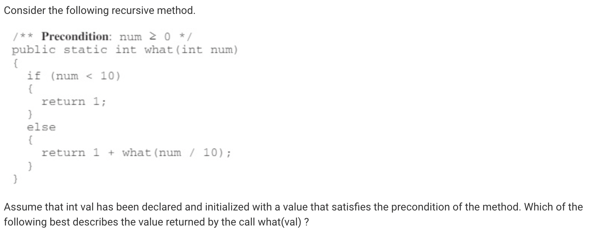
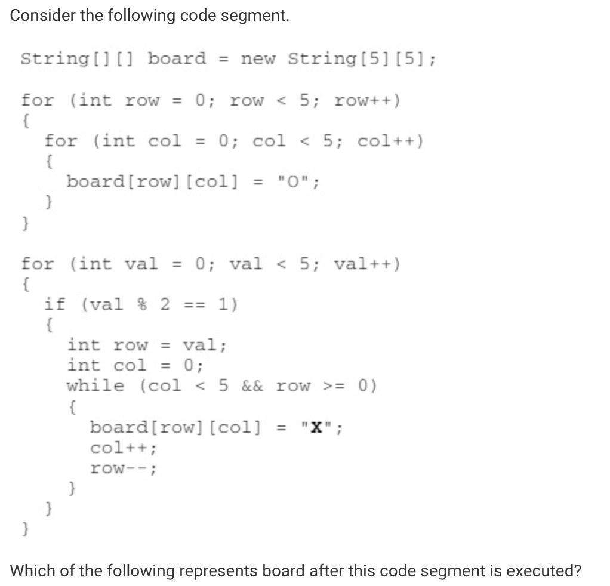
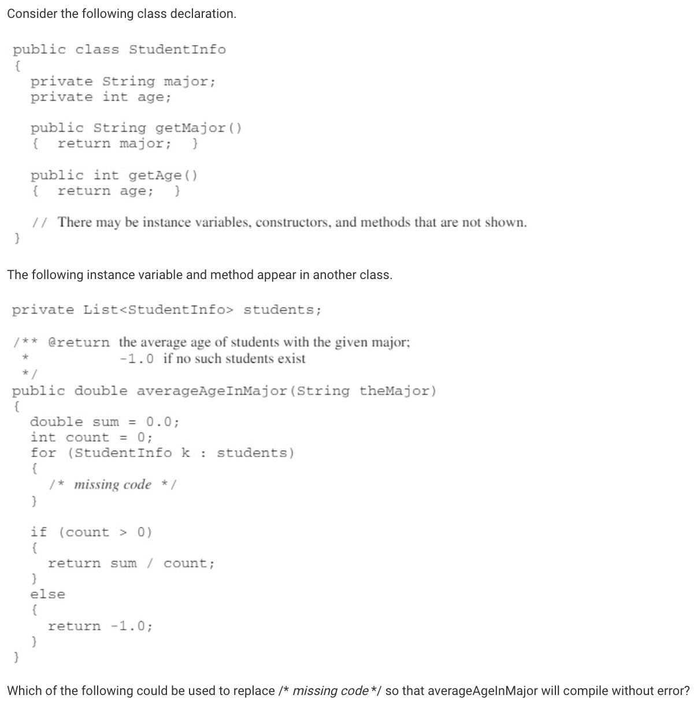
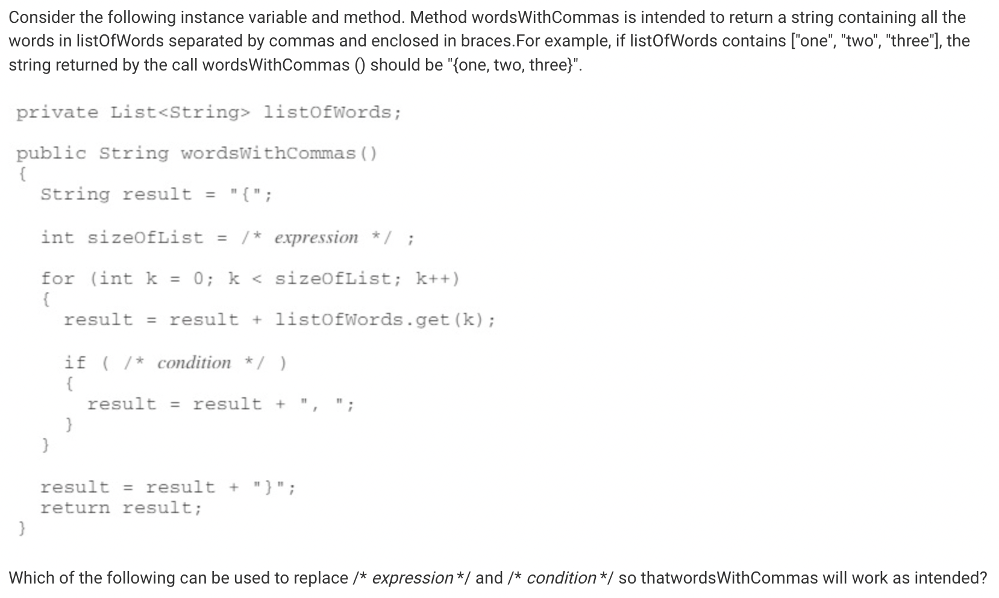

## Corrections

| Question Number | Original Reasoning | Revision |
| --------------- | ------------------ | -------- |
| 9.  | My original answer for this question was C: (int) (Math.random() * 6) + (int) (Math.random() * 6). I thought that this was the correct answer because I forgot that Math.random would range from 0 to 5, not 1 to 6. | The correct answer is E: 2 + (int) (Math.random() * 6) + (int) (Math.random() * 6). For two dice, the number that is created can range from 2 to 12, which is why 2 needs to be added to the sum of the random numbers. |
| 21.  | My original answer for this question was C: ATCH, ATC, AT, A. This is incorrect because this would be the result of temp being assigned a substring of the parameter with the first character removed in the first recursive call and then the last character removed in subsequent calls. | The correct answer is D: WATC, WAT, WA, W because during each recursive call to whatsItDo, temp is assigned a substring of the parameter that excludes the last character, then prints this to the screen and calls whatsItDo with this substring. For the first recursive call, whatsItDo(“WATCH”) will print WATC and call whatsItDo(“WATC”). The call whatsItDo(“WATC”) will print WAT and call whatsItDo(“WAT”). The call whatsItDo(“WAT”) will print WA and call whatsItDo(“WA”). The call whatsItDo(“WA”) will print W and call whatsItDo(“W”). Since the length of string “W” is not greater than 1, the recursive method is complete. |
| 22.  | My original answer for this quesiton was E, but this is incorrect bcause in this case, the nested for loop iterate over numbers in column major order 142536 will be printed. | The correct answer is A because the outer for loop iterates over every row of numbers and assigns each row to the array row.  The inner loop iterates over the array row accessing each element and assigning it to n. Then n is printed to the screen. In the first iteration of the outer loop, row is equal to {1, 2, 3}, and the inner loop will assign each successive value in row to n and print it to the screen, meaning 123 will be printed. For the second iteration of the outer loop, row is equal to {4, 5, 6}, and the inner loop will assign each successive value in row to n and print it to the screen, meaning 456 will be printed after 123, giving us the output 123456. | 
| 25.  | My original answer for this question was B: 8, but this is incorrect because this would be the value of count after the first two iterations of the outer loop if the inner loop started iterating at 0 each time instead of x. | The correct answer is C: 10, the outer loop iterates four times (for x = 0, 1, 2, 3). When x is assigned 4, the loop terminates. The inner loop will iterate from the value of x to 4, not including 4. In the first iteration of the outer loop, the inner loop iterates four times (for y = 0, 1, 2, 3) and count will increase by 1 each time and will equal to 4. In the second iteration of the outer loop, the inner loop iterates three times (for y = 1, 2, 3) and count will now be 7. In the third iteration of the outer loop, the inner loop iterates two times (for y = 2, 3) and count will now be 9. In the fourth and final iteration of the outer loop, the inner loop will iterate one time (for y = 3) and count will be 10. |
| 27.  | My original answer for this question was E: {1,3,2,5,4,6}. This is incorrect because this is the result of one pass through the outer loop. | The correct answer is B: {1,2,3,5,4,6}. This is because the selection sort algorithm shown looks for the smallest value in the elements ranging from index j to the end and swaps the smallest value with the value at position j. In the first pass, 1 is the smallest element from position j = 0 to the end of the array, so it is swapped with 6, resulting in {1, 3, 2, 5, 4, 6}. In the second pass, 2 is the smallest element from position j = 1 to the end of the array, so it is swapped with 3, resulting in {1, 2, 3, 5, 4, 6}. In the third pass, 3 is the smallest element from position j = 2 to the end of the array, it is swapped with itself, resulting in {1, 2, 3, 5, 4, 6}. | 
| 29.  | My original answer for this question was B: The sum of the digits in the decimal representation of val is returned. This is incorrect because the mod operator (%) would need to be used to access the individual digits of num in order to compute the sum of the digits. | The correct answer is A: The number of digits in the decimal representation of val is returned. This is becaues each recursive call is made with the value num  / 10. The expression num / 10 uses integer division and evaluates to an integer that is num with the right most digit removed. For example, 258 / 10 = 25. Each time the recursive call is made, what is returned is 1 plus the result of the recursive call. For example, what(258) = 1 + what(25) and what(25) = 1 + what(2) and what(2) = 1. Therefore what(258) = 1 + 1 + 1 or 3, which is the number of digits in 258. | 
| 31.  | My original answer for this question was D. This is incorrect because the output would require the second set of nested loops to initialize row to val – 1, increment both row and col in each iteration inner loop (instead of row being decremented) and changing the condition on the inner loop to col < 5 && row < 5. | The correct answer is E because the first set of nested for loops sets each element in board to “O”. The next for loop starts val at 0 and increments by 1 until val is 4, when val is 5 the loop terminates. When val is even, board is not updated, so nothing happens when val is 0. When val is 1, row is assigned 1 and col is assigned 0. The boolean condition in the while loop is true, so board[1][0] is assigned “X”. Then col is incremented to 1 and row is decremented to 0 and board[0][1] is assigned “X”. Then col is incremented to 2 and row is decremented to -1 and the while loop terminates. When val is 2, nothing changes about board. When val is 3, row is assigned 3 and col is assigned 0. The boolean condition in the while loop is true, so board[3][0] is assigned “X”. Then col is incremented to 1 and row is decremented to 2 and board[2][1] is assigned “X”. Then col is incremented to 2 and row is decremented to 1 and board[1][2] is assigned “X”. Then col is incremented to 3 and row is decremented to 0 and board[0][3] is assigned “X”. Finally, col is incremented to 4 and row is decremented to -1 and the while loop terminates. When val is 4, nothing changes about board. | 
| 32.  | My original answer for this question was C. This is incorrect because instance variable major is private to StudentInfo and can only be accessed by calling the accessor method getMajor. | The correct is answer is B, because to calculate the average age in a given major, you have to find all the students in the given major, add up their ages, and divide by the total number of students in the major. Since theMajor is a String, the if statement needs to use .equals to compare theMajor with the major of k, found by calling the getMajor() method on k. If this boolean expression is true, we need to add the age of k, found by calling the getAge() method on k to sum and increase count by 1. | 
| 34.  | My original answer for this question was C: listOfWords.size() - 1 / k != sizeOfList - 1. This answer is incorrect because list is an interface, which an ArrayList implements. Please note that List is no longer tested as part of the AP CSA exam and ArrayList will be used instead.  The size of a list is found by calling the method size without subtracting 1. Subtracting 1 would cause the last element in the list to be skipped. | The correct answer is D: listOfWords.size() / k != sizeOfList - 1, because to determine the size of an ArrayList we need to call the method size(). Each word will be separated by a comma, but no comma should appear after the last element in the list. Therefore, a comma is added as long as k does not equal the last index, sizeOfList – 1, since list indices start at 0. | 

## Reflection
I feel as though I could have gotten a higher score if I had carefully read each of the questions and spent some more time on certain problems. When looking at the time that I took for each question, I noticed that the time I spent for a question varied wildly, as I spent only 30 seconds on some problems and 10 minutes on others. On the AP exam, I would have 1 hour and 30 minutes to take a 40 question multiple choice exam in one sitting, but with this test I took less time and did not take it one sitting, which may have contributed to my low score. 